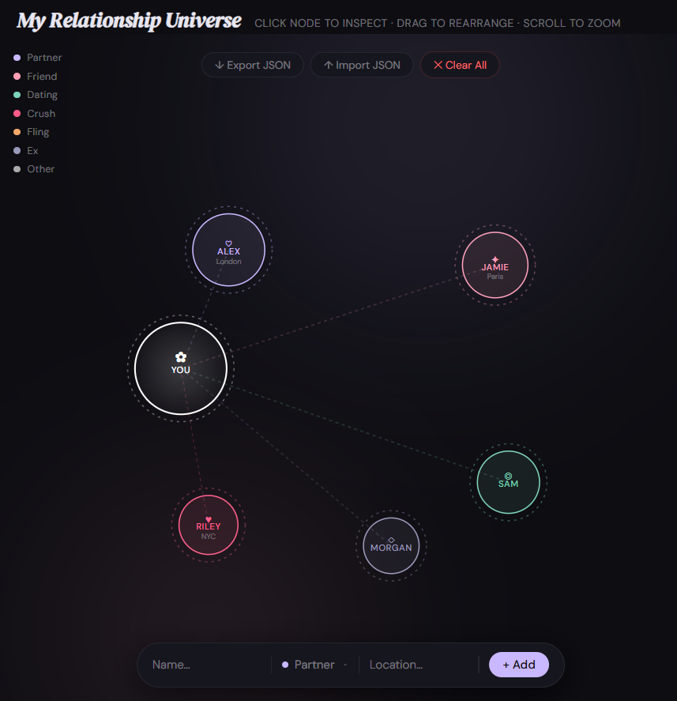
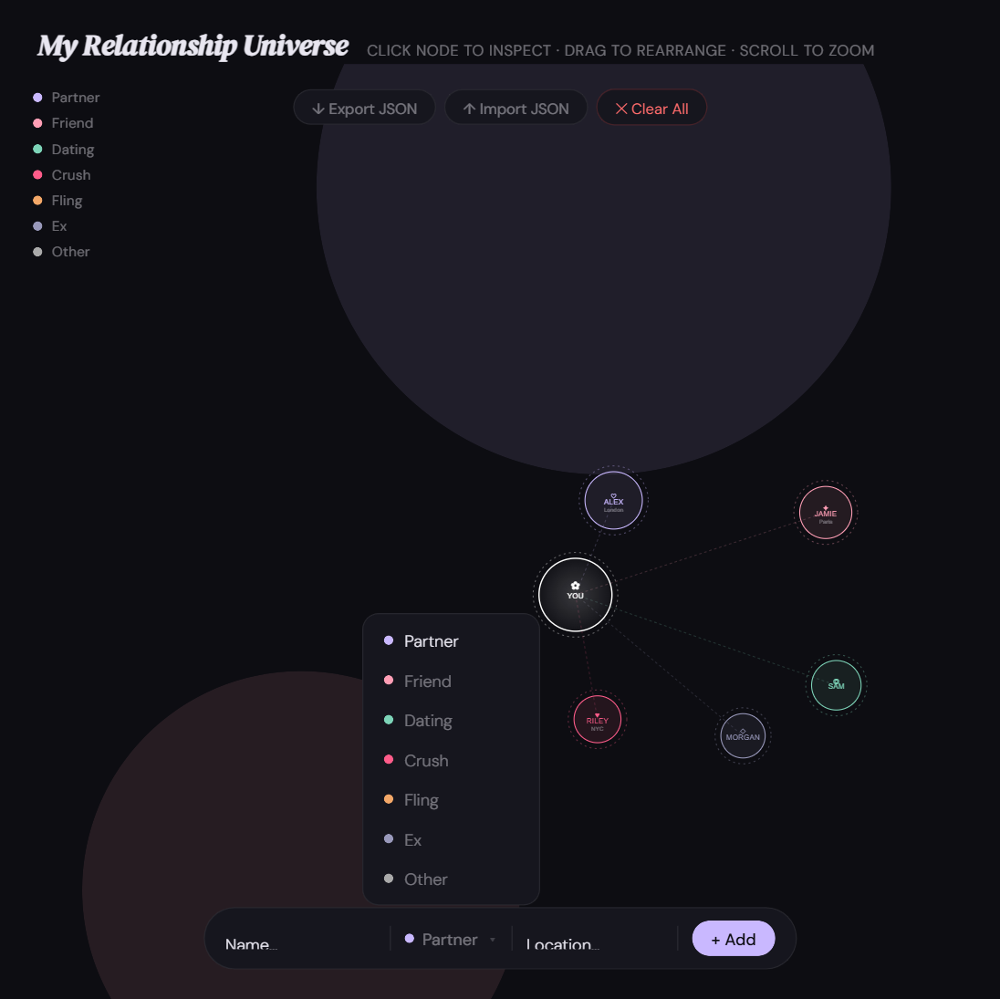
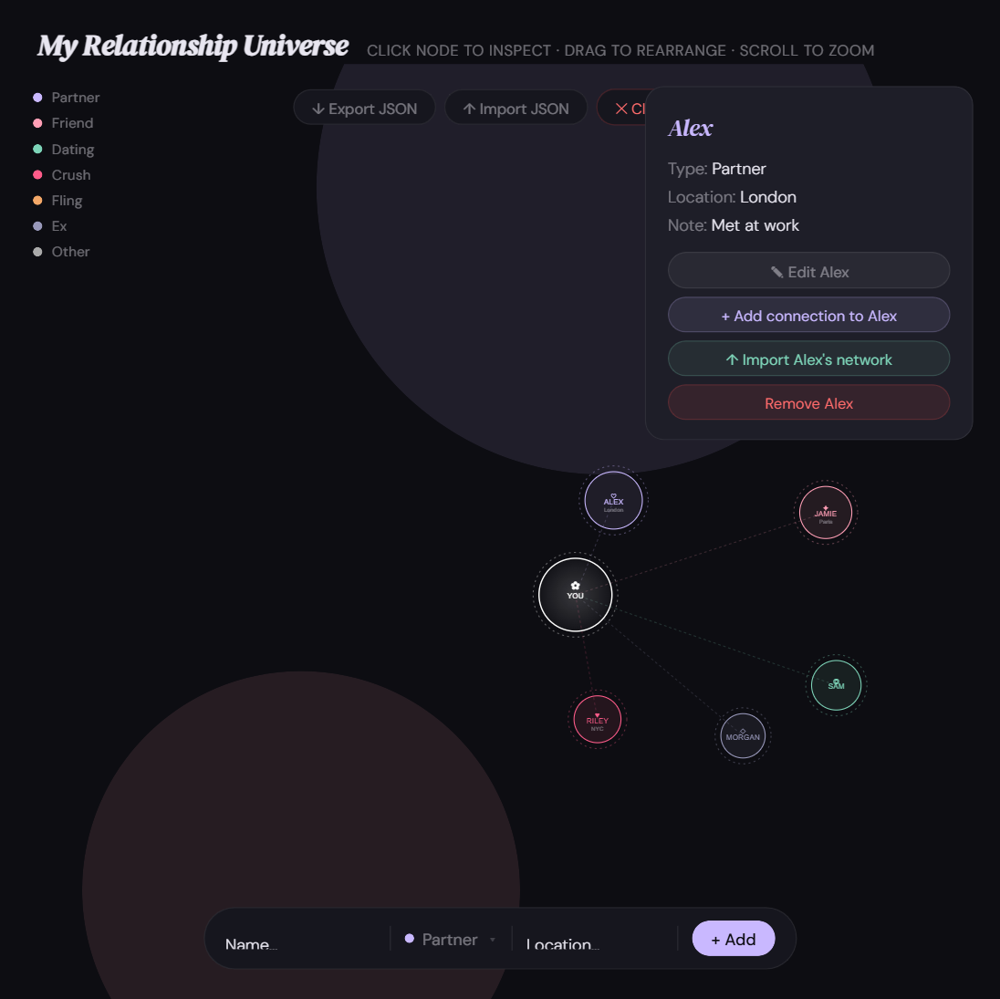

# My Relationship Universe

An interactive force-graph for mapping the people in your life. Built with D3.js — no framework, no build step, no backend.

## Quick start

### 1. Add someone

Type a name, pick a relationship type from the styled dropdown, optionally add a location, then hit **+ Add**.

### 2. Inspect & edit

Click any node to open the info panel. From there you can edit their details, add a connection to them, import their network, or remove them.

### 3. Rearrange

Drag nodes to reposition them. Scroll to zoom. The graph stays wherever you leave it — your data is saved automatically in `localStorage`.

---

## Features

- **Add people** — name, relationship type, and optional location
- **Connect mode** — link any person to another to show second-degree relationships
- **Edit / remove** — click any node to inspect, edit, or delete
- **Drag & rearrange** — reposition nodes freely; scroll to zoom
- **Export & import** — save your graph as JSON and reload it later
- **Network import** — merge someone else's exported graph into yours, anchored to their node
- **Persisted locally** — your graph is saved in `localStorage` so it survives page refreshes

## Relationship types

| Type | Colour |
|------|--------|
| Partner | Lavender |
| Friend | Pink |
| Dating | Teal |
| Crush | Hot pink |
| Fling | Orange |
| Ex | Muted purple |
| Other | Gray |

## Usage

Open `index.html` directly in a browser, or serve the folder with any static file server.

To deploy on **GitHub Pages**: push to a public repo and enable Pages from the repository settings (source: root of `main` branch).

## Stack

- [D3.js v7](https://d3js.org/) — force simulation & SVG rendering
- Plain HTML / CSS / JS — zero dependencies beyond D3
